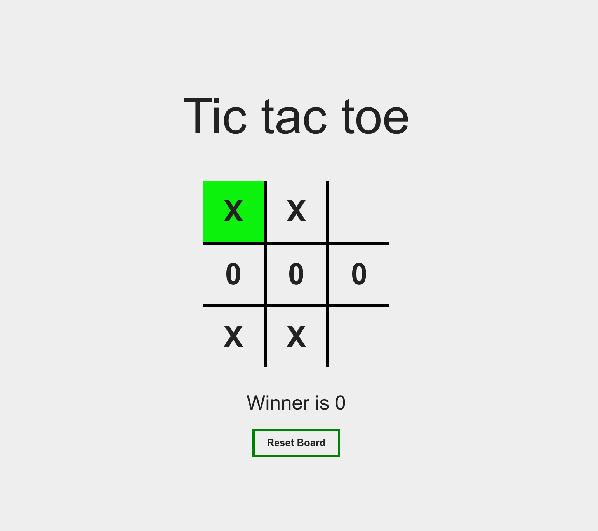

# tic-tac-toe
Game Tic-tac-toe on Vue 3



## I used in project:
- Vue 3
- socket.io

## Improvement plans:
- improve ui
- improve design
- add new play mods
- add authorization

## Project Setup

```sh
npm install
```

### Compile and Hot-Reload for Development

```sh
npm run dev
```

### Compile and Minify for Production

```sh
npm run build
```

### Lint with [ESLint](https://eslint.org/)

```sh
npm run lint
```
